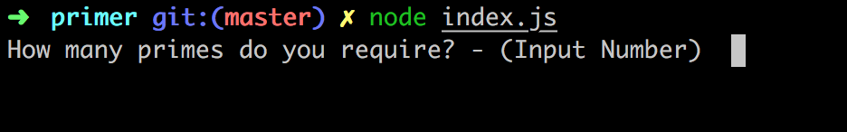
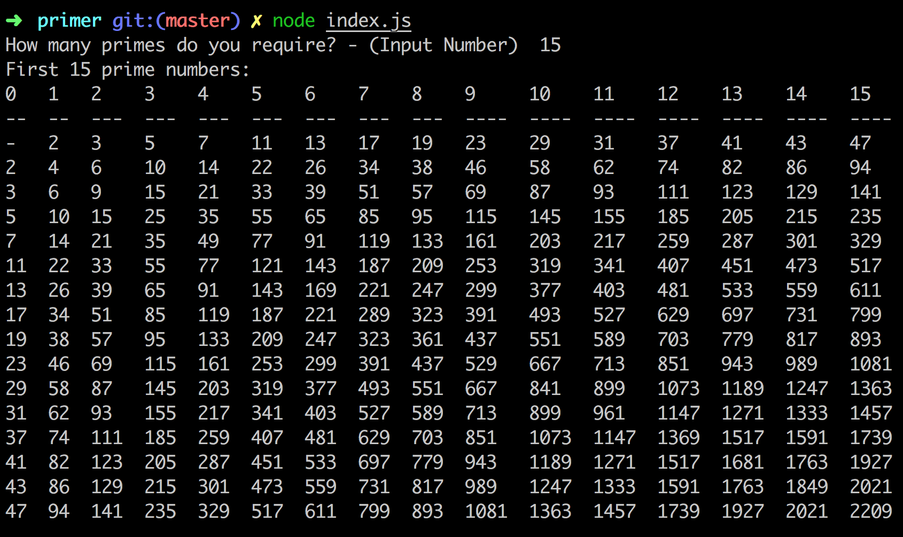
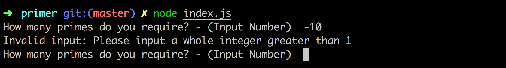

Primer - Prime Generator
========================

## The Task
* An application that takes numeric input (N) from a user and outputs a multiplication table of (N) prime numbers.
* Should have an performant prime algorithm that can generate a list of 20,000+ primes.
* the user should input a whole number N, where is N is at least 1
* the application should output an N+1 x N+1 grid of numbers

* Example primes multiplication table when N is 3
```
|      |    2 |    3 |    5 |
|    2 |    4 |    6 |   10 |
|    3 |    6 |    9 |   15 |
|    5 |   10 |   15 |   25 |
```

## Approach
- The application should be able to generate a list of prime numbers, Sieve of Eratosthenes seems to be one of the most efficient ways to achieve this.
- Use the Pie function to estimate the upper limit, required to generate n primes. Since the Seive of Eratosthenes method generates prime numbers up to a given limit and we want a given number of primes.
- Make sure that more primes are generated with the sieve than are needed by the user.
- Multiply the resulting array of primes by each number in the initial array to generate a 2D array that will be printed as a multiplication table.
- Make sure any erroneous inputs are handled, using regex for simplicity.


#### TDD the building of these key features:
- Generate Prime Numbers up to N
- Print Multiplication Table for primes up to N
- Handle user inputs: only accept whole numbers greater than 1

## Structure

## To Run

- Clone & open the repo!

```
git clone git@github.com:tobywinter/primer.git

cd primer
```
- Make sure you have node installed and run:

```
npm install
```

#### Run the Tests in the console

```
jasmine
```

#### Run the App in the console!

```
node index.js

```

## Screenshots
#### Running the App



#### Displaying the results


#### Uncoopperative Users!


## Technologies
 - Javascript
 - Jasmine
 - easy-table
 - requirejs

## What I Am Happy With
- Learning about the different algorithm's used to generate prime numbers was fascinating, and I'm really please I got the sieveOfEratosthenes algorithm to work and include a few optimisations gleaned from my research.
- Really pleased that the PrimeGenerator method worked properly after I realised I had gotten my nth prime estimation wrong. The fix isn't ideal but it works.

## Improvements

Given time to develop:
- I would want to try and optimise the nth prime estimate method, in my research online I found that there are several ways to do this a lot more accurately that I have, but understanding an implementing them was proving time consuming so I opted for a method which made an estimate that remains large enough to generate enough primes even when generating 200,000+ (in testing).
- I would definitely clean up some larger functions, try and break them down into smaller functions, but since the scope of the app is quite small it didn't prove very necessary at this stage.
- It'd be worth doing a front end version of the print out on a web page since the width limitations of the console make larger print outs unreadable.
